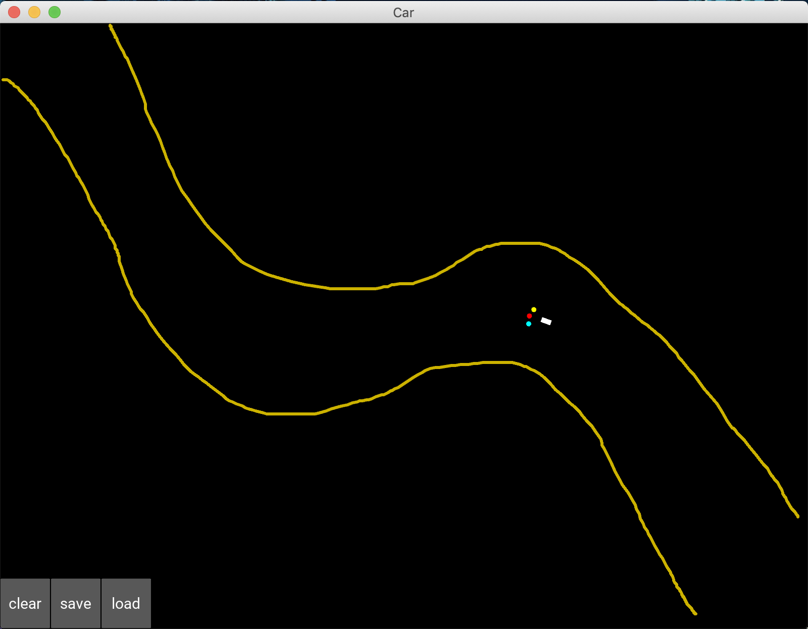

# Self Driving Car Simulator
An AI driven self-driving car simulator:
Uses Deep Q-Learning neural networks to learn paths for going from the top left to the bottom right of the screen, 
as defined by the user. 

The yellow boundaries (or 'sand') can be created by drag-clicking across the panel. 
The program is able to save the learned data into file, and then load it on demand. The program
handles exception cases well due to embedded experience replays. The default settings for the 
program are set for optimal learning rates.

